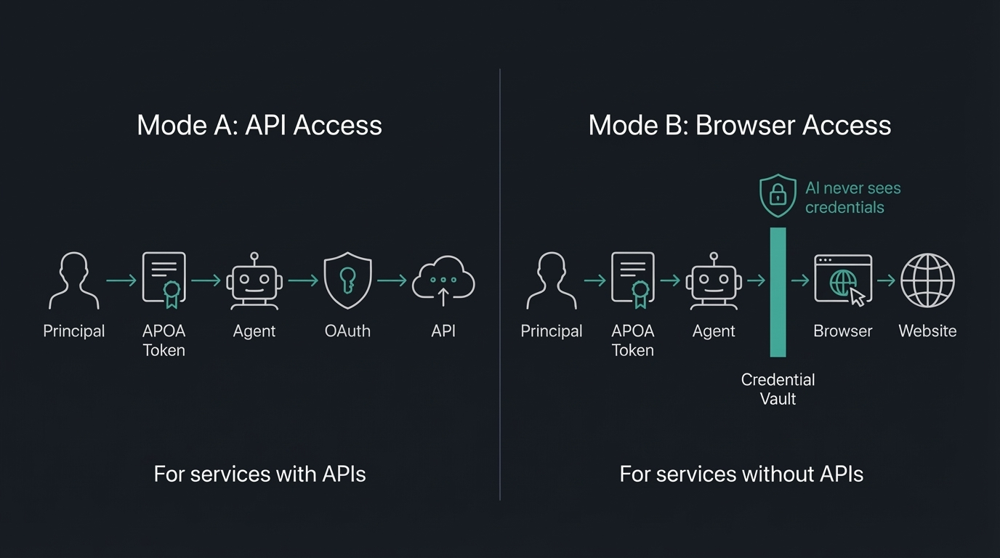
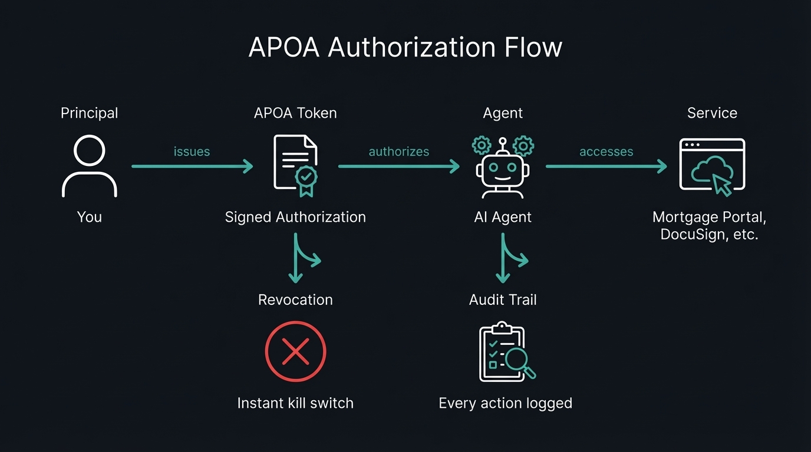
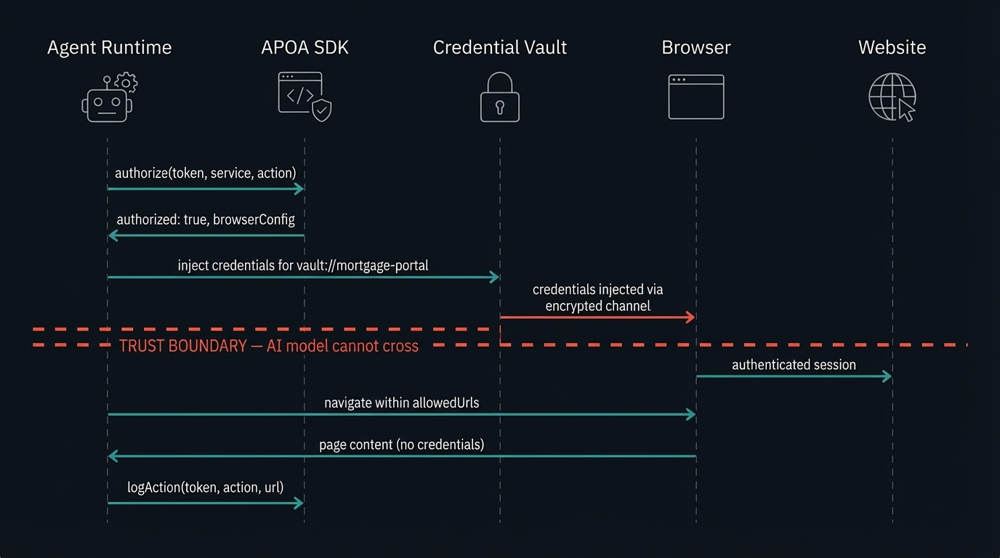
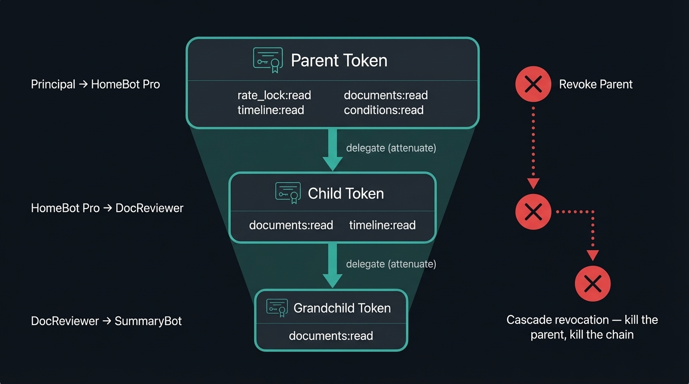

[](assets/banner.png)

# 🐴 Agentic Power of Attorney (APOA)

*Pronounced "ah-POH-ah" like aloha 🤙*

**Authorization infrastructure for AI agents.**

> In January 2026, a developer [gave an AI agent access to his email, calendar, and browser](https://aaronstuyvenberg.com/posts/clawd-bought-a-car) and told it to buy him a car. The agent negotiated a $4,200 discount and closed the deal. It also sent a confidential email to the wrong person — because its entire authorization model was a natural language prompt that said "prompt me before replying to anything consequential."
>
> AI agents are already negotiating, transacting, and acting on behalf of humans — with zero formal authorization, no audit trail, and no kill switch. We think the infrastructure should catch up.

---

## The Problem

Every agent authorization framework assumes your target service has an API. Meanwhile, your mortgage lender's web portal looks like it was built during the Bush administration. Your health insurance company will add OAuth right after they finish migrating off Internet Explorer. Your title company's "secure document center" has a password requirement of exactly 8 characters, no special characters allowed.

If every service had an API, we wouldn't need APOA. They don't. So here we are.

APOA fixes this with two things we haven't seen addressed together anywhere else:

**1. Browser-based agent authorization.** Your agent needs to check your mortgage rate lock. Your lender doesn't have an API. APOA authorizes a browser session where credentials come from a vault — the AI never sees them — and every action is scoped, audited, and instantly revocable.

**2. Natural language rules that actually do something.** Not just scopes and permissions. Rules like "never sign, submit, or commit to anything" that are machine-enforced. Rules like "alert me if any deadline is within 48 hours" that are logged and trigger callbacks. Traditional auth can't express this. APOA can.



---

## SDKs — Install It, It Works

### TypeScript

```bash
npm install @apoa/core
```

```typescript
import { createToken, checkScope, generateKeyPair } from '@apoa/core';

const keys = await generateKeyPair();

const token = await createToken({
  principal: { id: "did:apoa:you" },
  agent: { id: "did:apoa:your-agent", name: "HomeBot Pro" },
  services: [{
    service: "nationwidemortgage.com",
    scopes: ["rate_lock:read", "documents:read"],
    accessMode: "browser",
    browserConfig: {
      allowedUrls: ["https://portal.nationwidemortgage.com/*"],
      credentialVaultRef: "1password://vault/mortgage-portal",
    }
  }],
  expires: "2026-09-01"
}, { privateKey: keys.privateKey });

checkScope(token, "nationwidemortgage.com", "rate_lock:read");
// { allowed: true, reason: "matched scope 'rate_lock:read'" }

checkScope(token, "nationwidemortgage.com", "documents:sign");
// { allowed: false, reason: "scope 'documents:sign' not in authorized scopes" }
```

### Python

```bash
pip install apoa
```

```python
from apoa import (
    APOADefinition, Agent, BrowserSessionConfig, Principal,
    ServiceAuthorization, create_client, generate_key_pair,
)

private_key, public_key = generate_key_pair()
client = create_client(default_private_key=private_key)

token = client.create_token(APOADefinition(
    principal=Principal(id="did:apoa:you"),
    agent=Agent(id="did:apoa:your-agent", name="HomeBot Pro"),
    services=[ServiceAuthorization(
        service="nationwidemortgage.com",
        scopes=["rate_lock:read", "documents:read"],
        access_mode="browser",
        browser_config=BrowserSessionConfig(
            allowed_urls=["https://portal.nationwidemortgage.com/*"],
            credential_vault_ref="1password://vault/mortgage-portal",
        ),
    )],
    expires="2026-09-01",
))

result = client.authorize(token, "nationwidemortgage.com", "rate_lock:read")
# AuthorizationResult(authorized=True, ...)

result = client.authorize(token, "nationwidemortgage.com", "documents:sign")
# AuthorizationResult(authorized=False, reason="scope 'documents:sign' not in authorized scopes")
```

Both SDKs produce and consume the same JWT tokens -- a token signed in TypeScript validates in Python and vice versa.

The SDKs handle token creation, signing, validation, scope checking, constraint enforcement, hard/soft rule enforcement, delegation with capability attenuation, chain verification, cascade revocation, and audit logging. See [`sdk/`](sdk/) for TypeScript and [`sdk-python/`](sdk-python/) for Python.

---

## What Is This, Actually?

There's a concept that has existed in law for *literally centuries*: power of attorney. You sign a document, you say "this person can do these things on my behalf, within these limits, until this date." Done. Your grandmother has one. It's not complicated.

APOA is that — but for AI agents operating in the digital world. An open standard that defines how a human (the **Principal**) formally authorizes an AI agent (the **Agent**) to access and act within digital services (the **Services**) on their behalf — with explicit scope, time limits, and a full audit trail.



**The APOA Token** is a signed JWT that contains everything needed to understand the authorization:

| Field | What It Does | Example |
| --- | --- | --- |
| `principal` | Who's granting authority | `did:apoa:jane_xyz` |
| `agent` | Who's receiving authority | `did:apoa:homebot_abc` |
| `agentProvider` | The legal entity on the hook | `HomeBot Inc.` |
| `service` | Where the agent can go | `nationwidemortgage.com` |
| `scope` | What the agent can do there | `["rate_lock:read", "documents:read"]` |
| `constraints` | Hard limits | `{signing: false, data_export: false}` |
| `accessMode` | How it connects | `"browser"` or `"api"` |
| `browserConfig` | URL jail + vault reference | `{allowedUrls: [...], credentialVaultRef: "..."}` |
| `rules` | Behavioral directives | `"Never sign, submit, or commit to anything"` |
| `legal` | Jurisdiction + legal basis | `{jurisdiction: "US-CA", legalBasis: ["UETA-14"]}` |
| `expires` | When it dies | `2026-06-15` |

---

## Show Me a Real Scenario

You're buying a home. Congratulations! Here's your reward: four different web portals, none of which talk to each other, all with time-sensitive deadlines that will absolutely not remind you before they pass.

```yaml
authorization:
  type: "real_estate"
  principal: "Jane Doe"
  agent: "HomeBot Pro"
  agentProvider:
    name: "HomeBot Inc."
    contact: "support@homebot.ai"
  services:
    - service: "nationwidemortgage.com"           # No API. Browser mode.
      scope: ["rate_lock:read", "documents:read", "timeline:read"]
      accessMode: "browser"
      browserConfig:
        allowedUrls: ["https://portal.nationwidemortgage.com/*"]
        credentialVaultRef: "1password://vault/mortgage-portal"
        captureScreenshots: true
        blockedActions: ["click:*sign*", "click:*submit*", "click:*approve*"]

    - service: "docusign.com"                     # Has an API. API mode.
      scope: ["documents:read", "documents:flag_for_review"]
      accessMode: "api"
      constraints:
        signing: false

    - service: "acmetitle.com"                    # No API. Browser mode.
      scope: ["closing_timeline:read", "title_search:read"]
      accessMode: "browser"
      browserConfig:
        allowedUrls: ["https://portal.acmetitle.com/transaction/*"]
        credentialVaultRef: "1password://vault/title-company"

    - service: "redfin.com"                       # No API. Browser mode.
      scope: ["saved_searches:read", "market_data:read"]
      accessMode: "browser"
      browserConfig:
        allowedUrls: ["https://www.redfin.com/myredfin/*"]
        credentialVaultRef: "1password://vault/redfin"
        blockedActions: ["click:*offer*", "click:*tour*"]
  rules:
    - "Alert me if any deadline is within 48 hours"          # soft — logged + callback
    - "Never sign, submit, or commit to anything"            # hard — machine-enforced
    - "Summarize new activity daily at 8am"                  # soft — logged
  legal:
    model: "provider-as-agent"
    jurisdiction: "US-CA"
    legalBasis: ["UETA-14", "E-SIGN"]
  expires: "2026-06-15"
  revocable: true
```

Four services. Three browser-based, one API. Zero signing authority. Every action logged. Instantly revocable. No passwords shared with any AI model.

**Today:** You spend hours each week logging into portals, refreshing pages, and lying awake at night wondering if you missed a disclosure deadline.

**With APOA:** Your agent monitors everything, alerts you to what matters, and keeps a complete audit trail — without ever having the authority to commit you to anything. And as the standard evolves toward [high-authority delegation](SPEC.md#appendix-d-future-work), the same agent that monitors your mortgage today negotiates the deal tomorrow.

More scenarios (healthcare coordination, new parent logistics) are in [EXAMPLES.md](EXAMPLES.md).

---

## How Mode B Actually Works

This is the part that gets hand-waved in most authorization discussions, because it's genuinely hard. Here's how APOA approaches it.



```
1. Agent runtime receives task: "check Jane's rate lock status"
2. Runtime calls authorize(token, "nationwidemortgage.com", "rate_lock:read")
   → authorized: true
3. Runtime reads browserConfig from the token:
   → allowedUrls, credentialVaultRef, blockedActions
4. Runtime requests credential injection from vault
   → Vault injects credentials via encrypted channel
   → AI model NEVER sees the credentials
5. Agent navigates mortgage portal within URL restrictions
6. Every action logged to audit trail with URL + screenshot
7. Session terminates after maxSessionDuration (30 min)
```

The SDK handles steps 2 and 6 (authorization + audit). The credential vault handles step 4 (injection). The browser runtime handles steps 3, 5, and 7. Nobody handles the credentials except the vault.

---

## Delegation Chains (They Only Shrink)

When your agent delegates to a sub-agent, permissions can only get *narrower*. That's not a guideline — it's cryptographically enforced.



```
Parent Token (you → HomeBot Pro)
  scope: [rate_lock:read, documents:read, timeline:read, conditions:read]

  └── Child Token (HomeBot Pro → DocReviewer)
        scope: [documents:read]                    ← subset only
        expires: ≤ parent expiration               ← cannot outlive parent
        rules: parent rules + additional            ← can only add, not remove
        delegation_depth: decremented              ← eventually hits 0
```

Revoke the parent? Every child in the chain dies instantly. That's cascade revocation, and it's the default because leaving orphaned child tokens alive is almost never what you want.

---

## Why Not Just Use...

| Approach | APIs? | Browsers? | Scoped? | Revocable? | Auditable? | Delegation? | Legal? |
| --- | --- | --- | --- | --- | --- | --- | --- |
| OAuth 2.0 | ✅ | ❌ | ✅ | ✅ | Partial | ❌ | ❌ |
| MCP Auth | ✅ | ❌ | ✅ | ❌ | Partial | ❌ | ❌ |
| ZCAP-LD | ✅ | ❌ | ✅ | ✅ | ❌ | ✅ | ❌ |
| Browser automation | ❌ | ✅ | ❌ | ❌ | ❌ | ❌ | ❌ |
| Password sharing | ❌ | ✅ | ❌ | ❌ | ❌ | ❌ | ❌ |
| 1Password Autofill | ❌ | ✅ | ❌ | ❌ | Partial | ❌ | ❌ |
| **APOA** | **✅** | **✅** | **✅** | **✅** | **✅** | **✅** | **✅** |

ZCAP-LD is the closest — we build on it directly. But it doesn't address browser-based services, audit requirements, natural language rules, or legal alignment. That's the gap.

---

## Ecosystem

- [`@apoa/mcp`](https://github.com/agenticpoa/apoa-mcp) — APOA authorization for MCP servers. Per-tool-call scoping, delegation chains, audit trails. Middleware or proxy mode.
- [Jean-Claw Van Damme](https://github.com/agenticpoa/jean-claw-van-damme) — Authorization gatekeeper for OpenClaw agents ([ClawHub](https://clawhub.ai/agenticpoa/jean-claw-van-damme))

---

## Prior Art & Related Work

APOA was designed in February 2026. We later found independent work arriving at similar conclusions from different directions — which is what you want to see when you're working on a standard.

**IETF draft-vattaparambil-positioning-of-poa-01 (October 2023)** — researchers at Lulea University of Technology applied the same Power of Attorney metaphor to IoT device authorization. Their principal-agent-delegation model for Cyber Physical Systems is strikingly parallel, though they target smart devices rather than AI agents. APOA was developed independently; the convergence validates the conceptual model.

**Google DeepMind, "Intelligent AI Delegation" (February 2026)** — Tomašev, Franklin, and Osindero proposed delegation with authority transfer, accountability chains, and capability attenuation via Delegation Capability Tokens. Their paper explicitly flagged MCP's missing policy layer for deep delegation chains — the gap APOA was designed to fill. Developed concurrently and independently.

**MCP 2026 Roadmap (March 2026)** — the official roadmap lists deeper security and authorization as a priority, with active SEPs for DPoP and Workload Identity Federation. APOA is designed as a complementary policy layer above MCP, not a replacement.

**IETF Agent Auth Drafts (2025-2026)** — multiple active Internet-Drafts tackle agent delegation within OAuth. These address API-based authorization. APOA's Mode B addresses the complementary problem: services without APIs.

---

## Technical Foundation

APOA builds on proven standards because the world has enough competing ones:

* **JWT (RFC 7519)** — token format
* **OAuth 2.1** — API-based authorization flows
* **W3C Verifiable Credentials** — portable, signed authorization packaging
* **ZCAP-LD** — capability attenuation model for delegation chains
* **W3C DIDs** — principal and agent identity
* **Web Bot Auth** (emerging) — agent identification for browser-based services

See [SPEC.md](SPEC.md) for the full technical specification. It's riveting. Well, it's thorough.

---

## Project Status

**Spec v0.1 complete. SDKs shipped. Seeking community feedback.**

- [x] Problem statement and concept definition
- [x] Landscape analysis of existing standards and gaps
- [x] Draft specification v0.1
- [x] Reference implementation (TypeScript SDK — [`@apoa/core`](sdk/))
- [x] Python SDK — [`apoa`](sdk-python/) (cross-SDK compatible)
- [ ] Community feedback and iteration
- [ ] Consumer product prototype (agent authorization dashboard)
- [ ] Security audit
- [ ] MCP integration proposal (Spec Enhancement Proposal)
- [ ] Formal standards body submission

---

## Get Involved

* **Install the SDK** — `npm install @apoa/core` (TypeScript) or `pip install apoa` (Python)
* **Read the spec** — [SPEC.md](SPEC.md) is the working draft
* **Open an issue** — critiques and "this will never work because..." are welcome
* **Join the discussion** — [Discussions tab](../../discussions) for broader conversations
* **Build with it** — if you're working on AI agents, browser automation, or identity, we want your input

---

## FAQ

<details>
<summary><strong>Is this a real legal power of attorney?</strong></summary>

No. AI systems cannot legally hold power of attorney under any jurisdiction. APOA is a *technical* authorization standard that borrows the *conceptual framework* — scoped delegation, bounded authority, principal-agent relationship. It's designed to align with existing electronic agency law (UETA, E-SIGN) and could serve as the technical foundation for future legal recognition. But we're not lawyers. *Please don't sue us.*
</details>

<details>
<summary><strong>How is this different from OAuth?</strong></summary>

OAuth handles delegated authorization for API-based services. Which is great — if you live in a world where every service has an API. You do not live in that world. APOA extends the model to services without APIs (via browser-based authorization with secure credential injection), adds agent-specific features (delegation chains, natural language rules, intent binding), and wraps everything in a legally meaningful framework. For API-based services, APOA uses OAuth under the hood. It's not a replacement, it's a completion.
</details>

<details>
<summary><strong>Isn't this just fancy password sharing?</strong></summary>

I take personal offense at the suggestion. APOA never shares credentials with the agent. For browser-based services, it uses secure credential injection — architecturally aligned with 1Password's Agentic Autofill — where a vault injects credentials into the browser session through an encrypted channel. The AI model never sees them. The APOA token authorizes the injection and scopes the session. The vault handles the credentials. It's the *opposite* of password sharing. It's password *never-sharing.*
</details>

<details>
<summary><strong>Why "Power of Attorney"?</strong></summary>

Because it's the best existing mental model: one entity formally authorizing another to act on their behalf, within defined boundaries, for a specific purpose and duration. Your grandmother understands what a power of attorney is. That intuition maps directly to what we need for AI agent authorization. We considered "Agentic Delegated Authorization Framework" but we wanted people to actually read the README.
</details>

<details>
<summary><strong>Isn't this just a Verifiable Credential?</strong></summary>

VCs answer "what is this entity?" — assertions about identity. APOA answers "what can this agent DO?" — bounded authority with scoped permissions, capability attenuation, delegation chains, constraint enforcement, audit trails, and revocation cascading. The W3C community debated this boundary extensively; the consensus is clear: using VCs as permission tokens mixes claims with authorization, and developers will implement it wrong. That's why ZCAP-LD exists as a separate spec. A VC can *package* an APOA token for portability, but the authorization semantics are what APOA defines and what VCs alone don't provide.
</details>

<details>
<summary><strong>Is there an APOA token or cryptocurrency?</strong></summary>

No. God, no. There is no coin, no NFT, no blockchain-based financial product, and no airdrop. The word "token" in this project refers exclusively to a signed JWT authorization document. It has the market value of a JSON file, which is zero dollars. If someone is selling you one, they are scamming you. Please [open an issue](../../issues) so we can make their life difficult.
</details>

---

## ⚠️ No Tokens. No Coins. No NFTs.

**Agentic POA has no cryptocurrency, no token, no coin, no NFT, and no blockchain-based financial product of any kind.** Not now. Not ever. If someone claims otherwise — **it is a scam.**

---

## License

Apache 2.0 — see [LICENSE](LICENSE).

## Origin

Agentic Power of Attorney was coined in February 2026 to address the absence of a universal standard for delegating bounded digital authority from humans to AI agents. Its mascot is Proxy, named for the oldest meaning of the word: one authorized to act on another's behalf.

---

🐴 *Meet **Proxy** — a [Pony of the Americas](https://en.wikipedia.org/wiki/Pony_of_the_Americas). Calm, intelligent, and built to earn your trust. Which is more than we can say for your insurance company's login page.*