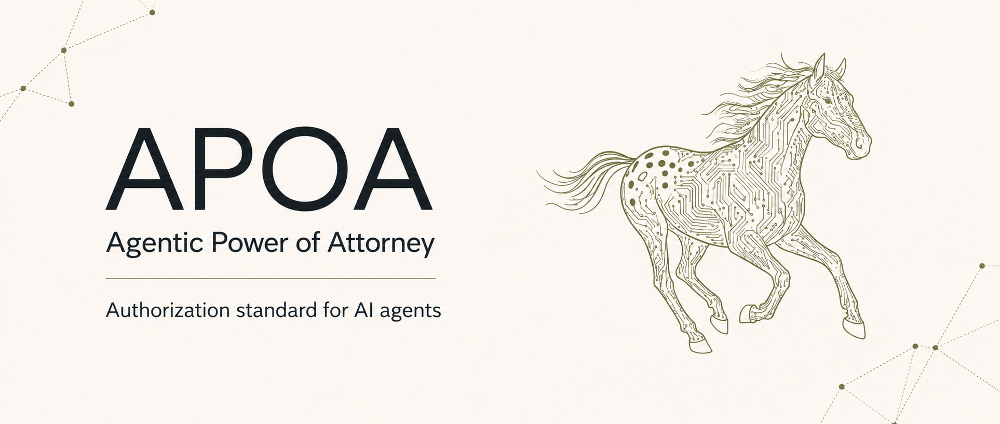
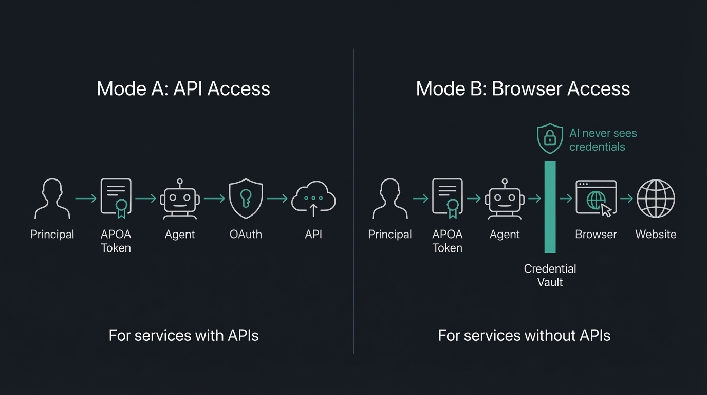
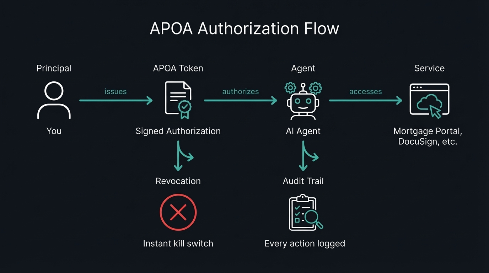
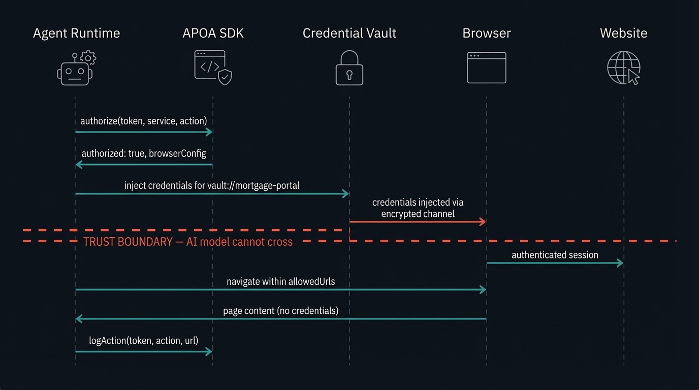
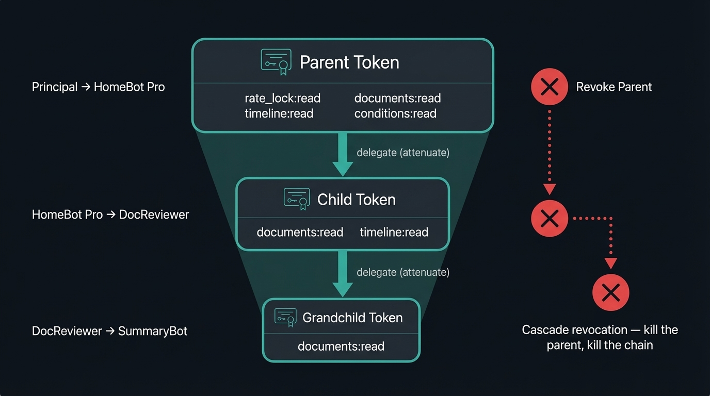

[](assets/banner.png)

<h1 align="center">🐴 Agentic Power of Attorney (APOA)</h1>

<p align="center"><em>Pronounced "ah-POH-ah" like aloha 🤙</em></p>

<p align="center">
  <a href="https://github.com/agenticpoa/apoa/actions/workflows/ci.yml"></a>
  <a href="LICENSE"></a>
  <a href="https://www.npmjs.com/package/@apoa/core"></a>
  <a href="https://www.npmjs.com/package/@apoa/core"></a>
  <a href="https://pypi.org/project/apoa/"></a>
  <a href="https://pepy.tech/project/apoa"></a>
</p>

<p align="center"><strong>Authorization infrastructure for AI agents.</strong></p>

<p align="center">
  <a href="#the-problem">Problem</a> ·
  <a href="#the-concept">Concept</a> ·
  <a href="#how-mode-b-actually-works">Mode B</a> ·
  <a href="#show-me-a-real-scenario">Scenario</a> ·
  <a href="#demos">Demos</a> ·
  <a href="#sdks--install-it-it-works">SDKs</a> ·
  <a href="#cross-sdk-compatibility">Compatibility</a> ·
  <a href="#delegation-chains-they-only-shrink">Delegation</a>
  <br>
  <a href="#why-not-just-use">Alternatives</a> ·
  <a href="#ecosystem">Ecosystem</a> ·
  <a href="#prior-art--related-work">Prior Art</a> ·
  <a href="#technical-foundation">Foundation</a> ·
  <a href="#project-status">Status</a> ·
  <a href="#get-involved">Get Involved</a> ·
  <a href="#license">License</a> ·
  <a href="#origin">Origin</a>
</p>

> In January 2026, a developer [gave an AI agent access to his email, calendar, and browser](https://aaronstuyvenberg.com/posts/clawd-bought-a-car) and told it to buy him a car. The agent negotiated a $4,200 discount and closed the deal. It also sent a confidential email to the wrong person — because its entire authorization model was a natural language prompt that said "prompt me before replying to anything consequential."
>
> AI agents are already negotiating, transacting, and acting on behalf of humans — with zero formal authorization, no audit trail, and no kill switch. We think the infrastructure should catch up.

---

## The Problem

Every agent authorization framework assumes your target service has an API. Meanwhile, your mortgage lender's web portal looks like it was built during the Bush administration. Your health insurance company will add OAuth right after they finish migrating off Internet Explorer. Your title company's "secure document center" has a password requirement of exactly 8 characters, no special characters allowed.

If every service had an API, we wouldn't need APOA. They don't. So here we are.

APOA combines two capabilities:

**1. Natural language rules that actually do something.** Not just scopes and permissions. Rules like "never sign, submit, or commit to anything" (`enforcement: hard` — denied at `authorize()` time) and rules like "alert me if any deadline is within 48 hours" (`enforcement: soft` — logged, triggers callbacks). Enforcement is mechanical: the SDK matches on the rule's `id`, not the natural-language description. APOA expresses both at the token level — see [SPEC §7](SPEC.md#7-rules) for the schema and semantics.

**2. Browser-based agent authorization.** Your agent needs to check your mortgage rate lock. Your lender doesn't have an API. APOA authorizes a browser session where credentials come from a vault — the AI never sees them — and every action is scoped, audited, and instantly revocable. As of May 2026 no shipping product covers this end-to-end (see [Mode B](#how-mode-b-actually-works) and [`docs/PRIOR_ART.md`](docs/PRIOR_ART.md)).



---

## The Concept

There's a concept that has existed in law for *literally centuries*: power of attorney. You sign a document, you say "this person can do these things on my behalf, within these limits, until this date." Done. Your grandmother has one. It's not complicated.

APOA is that — but for AI agents operating in the digital world. An open standard that defines how a human (the **Principal**) formally authorizes an AI agent (the **Agent**) to access and act within digital services (the **Services**) on their behalf — with explicit scope, time limits, and a full audit trail.



**The APOA Token** is a signed JWT that contains everything needed to understand the authorization:

| Field | What It Does | Example |
| --- | --- | --- |
| `principal` | Who's granting authority | `did:apoa:jane_xyz` |
| `agent` | Who's receiving authority | `did:apoa:homebot_abc` |
| `agentProvider` | The legal entity on the hook | `HomeBot Inc.` |
| `service` | Where the agent can go | `nationwidemortgage.com` |
| `scope` | What the agent can do there | `["rate_lock:read", "documents:read"]` |
| `constraints` | Hard limits | `{signing: false, data_export: false}` |
| `accessMode` | How it connects | `"browser"` or `"api"` |
| `browserConfig` | URL jail + vault reference | `{allowedUrls: [...], credentialVaultRef: "..."}` |
| `rules` | Behavioral directives | `"Never sign, submit, or commit to anything"` |
| `legal` | Jurisdiction + legal basis | `{jurisdiction: "US-CA", legalBasis: ["UETA-14"]}` |
| `expires` | When it dies | `2026-06-15` |

---

## How Mode B Actually Works

This is the part that gets hand-waved in most authorization discussions, because it's genuinely hard. Here's how APOA approaches it.



```
1. Agent runtime receives task: "check Jane's rate lock status"
2. Runtime calls authorize(token, "nationwidemortgage.com", "rate_lock:read")
   → authorized: true
3. Runtime reads browserConfig from the token:
   → allowedUrls, credentialVaultRef, blockedActions
4. Runtime requests credential injection from vault
   → Vault injects credentials via encrypted channel
   → AI model NEVER sees the credentials
5. Agent navigates mortgage portal within URL restrictions
6. Every action logged to audit trail with URL + screenshot
7. Session terminates after maxSessionDuration (30 min)
```

The SDK handles steps 2 and 6 (authorization + audit). The credential vault handles step 4 (injection). The browser runtime handles steps 3, 5, and 7. Nobody handles the credentials except the vault.

---

## Show Me a Real Scenario

You're buying a home: four different web portals, none of which talk to each other, all with time-sensitive deadlines. With APOA, you authorize your agent across all four — three browser-based, one API — with zero signing authority, every action logged, and instant revocation. No passwords shared with any AI model.

**Today:** You spend hours each week logging into portals, refreshing pages, and lying awake at night wondering if you missed a disclosure deadline.

**With APOA:** Your agent monitors everything, alerts you to what matters, and keeps a complete audit trail — without ever having the authority to commit you to anything. And as the standard evolves toward [high-authority delegation](SPEC.md#appendix-d-future-work), the same agent that monitors your mortgage today negotiates the deal tomorrow.

See [`docs/SCENARIOS.md`](docs/SCENARIOS.md) for the full home-purchase token (YAML, ~50 lines), and [`EXAMPLES.md`](EXAMPLES.md) for additional scenarios across healthcare and other domains.

---

## Demos

Working end-to-end demos that exercise the SDK against real services and real signing.

### [`negotiate`](https://github.com/agenticpoa/negotiate) — AI agents negotiate a YC SAFE

Two agents — founder-side and investor-side — negotiate a SAFE using the Rubinstein alternating-offers model. Each agent operates inside an APOA token its principal signed: valuation cap floor/ceiling, discount bounds, MFN, pro-rata, signing posture. Every offer is constraint-validated and chained into a Merkle log; the executed PDF includes the full negotiation history.

[](https://youtu.be/l_wUpE8daOU)

```bash
git clone https://github.com/agenticpoa/negotiate.git
cd negotiate && pip install -r requirements.txt
cp .env.example .env  # add ANTHROPIC_API_KEY
python negotiate.py --no-sshsign
```

### [`claw-negotiate`](https://github.com/agenticpoa/claw-negotiate) — same negotiation, OpenClaw + Telegram

The same SAFE-negotiation flow packaged as an OpenClaw skill: founder and investor each run their own OpenClaw, the two agents negotiate publicly in a Telegram group, signing happens privately in DMs, and the executed SAFE carries an [`sshsign`](https://github.com/agenticpoa/sshsign) audit trail. Demonstrates APOA across two independently-authorized agents in a real consumer surface.

[](https://www.youtube.com/watch?v=T2Y2Tr__g_k)

---

## SDKs — Install It, It Works

### TypeScript

```bash
npm install @apoa/core
```

```typescript
import { createToken, checkScope, generateKeyPair } from '@apoa/core';

const keys = await generateKeyPair();

const token = await createToken({
  principal: { id: "did:apoa:you" },
  agent: { id: "did:apoa:your-agent", name: "HomeBot Pro" },
  services: [{
    service: "nationwidemortgage.com",
    scopes: ["rate_lock:read", "documents:read"],
    accessMode: "browser",
    browserConfig: {
      allowedUrls: ["https://portal.nationwidemortgage.com/*"],
      credentialVaultRef: "1password://vault/mortgage-portal",
    }
  }],
  expires: "2026-09-01"
}, { privateKey: keys.privateKey });

checkScope(token, "nationwidemortgage.com", "rate_lock:read");
// { allowed: true, reason: "matched scope 'rate_lock:read'" }

checkScope(token, "nationwidemortgage.com", "documents:sign");
// { allowed: false, reason: "scope 'documents:sign' not in authorized scopes" }
```

### Python

```bash
pip install apoa
```

```python
from apoa import (
    APOADefinition, Agent, BrowserSessionConfig, Principal,
    ServiceAuthorization, create_client, generate_key_pair,
)

private_key, public_key = generate_key_pair()
client = create_client(default_private_key=private_key)

token = client.create_token(APOADefinition(
    principal=Principal(id="did:apoa:you"),
    agent=Agent(id="did:apoa:your-agent", name="HomeBot Pro"),
    services=[ServiceAuthorization(
        service="nationwidemortgage.com",
        scopes=["rate_lock:read", "documents:read"],
        access_mode="browser",
        browser_config=BrowserSessionConfig(
            allowed_urls=["https://portal.nationwidemortgage.com/*"],
            credential_vault_ref="1password://vault/mortgage-portal",
        ),
    )],
    expires="2026-09-01",
))

result = client.authorize(token, "nationwidemortgage.com", "rate_lock:read")
# AuthorizationResult(authorized=True, ...)

result = client.authorize(token, "nationwidemortgage.com", "documents:sign")
# AuthorizationResult(authorized=False, reason="scope 'documents:sign' not in authorized scopes")
```

The SDKs handle token creation, signing, validation, scope checking, constraint enforcement, hard/soft rule enforcement, delegation with capability attenuation, chain verification, cascade revocation, and audit logging. See [`sdks/typescript/`](sdks/typescript/) for TypeScript and [`sdks/python/`](sdks/python/) for Python.

For production deployments:

- **Storage** — the `RevocationStore` and `AuditStore` interfaces are pluggable. Point them at Redis, Postgres, DynamoDB, or whatever fits your stack. See [`docs/STORES.md`](docs/STORES.md) for concrete adapter recipes in both languages.
- **Key distribution** — principals publish public keys at `/.well-known/jwks.json`; relying parties fetch and cache. The SDKs ship `publicKeyToJWK` / `buildJWKS` helpers and a `createJWKSResolver` that plugs into `validateToken`. See [`docs/JWKS.md`](docs/JWKS.md).

---

## Cross-SDK Compatibility

Tokens are JWTs. A token signed by `@apoa/core` validates in `apoa` (Python) and vice versa — same algorithm, same payload schema, same scope and rule semantics.

```typescript
// In TypeScript: sign a token, hand off the JWT string.
const { raw } = await createToken(definition, { privateKey });
fetch("https://python-service/validate", { method: "POST", body: raw });
```

```python
# In Python: validate the same JWT, run authorization checks.
result = client.validate_token(raw_jwt, ValidationOptions(public_key=key))
assert result.valid
authz = client.authorize(result.token, "mychart.com", "appointments:read")
```

The serialization layer maps the camelCase JWT payload (e.g., `accessMode`, `agentProvider`) to snake_case in Python (`access_mode`, `agent_provider`) automatically. Cross-SDK fixture tests run on every CI build to catch any drift before it ships.

---

## Delegation Chains (They Only Shrink)

When your agent delegates to a sub-agent, permissions can only get *narrower*. That's not a guideline — it's cryptographically enforced.



```
Parent Token (you → HomeBot Pro)
  scope: [rate_lock:read, documents:read, timeline:read, conditions:read]

  └── Child Token (HomeBot Pro → DocReviewer)
        scope: [documents:read]                    ← subset only
        expires: ≤ parent expiration               ← cannot outlive parent
        rules: parent rules + additional            ← can only add, not remove
        delegation_depth: decremented              ← eventually hits 0
```

Revoke the parent? Every child in the chain dies instantly. That's cascade revocation, and it's the default because leaving orphaned child tokens alive is almost never what you want.

---

## Why Not Just Use...

| Approach | APIs? | Browsers? | Scoped? | Revocable? | Auditable? | Delegation? | Legal? |
| --- | --- | --- | --- | --- | --- | --- | --- |
| OAuth 2.0 | ✅ | ❌ | ✅ | ✅ | Partial | ❌ | ❌ |
| MCP Auth | ✅ | ❌ | ✅ | ❌ | Partial | ❌ | ❌ |
| ZCAP-LD | ✅ | ❌ | ✅ | ✅ | ❌ | ✅ | ❌ |
| South et al. (2025) | ✅ | ❌ | ✅ | ❌ | ✅ | ✅ | ❌ |
| `agent-passport-system` | ✅ | ❌ | ✅ | ✅ | ✅ | ✅ | ❌ |
| Browser automation | ❌ | ✅ | ❌ | ❌ | ❌ | ❌ | ❌ |
| Password sharing | ❌ | ✅ | ❌ | ❌ | ❌ | ❌ | ❌ |
| 1Password Autofill | ❌ | ✅ | ❌ | ❌ | ❌ | ❌ | ❌ |
| **APOA** | **✅** | **✅** | **✅** | **✅** | **✅** | **✅** | **✅** |

On the API side, the closest work is South et al.'s framework and `agent-passport-system`; APOA's distinct contribution is extending the model to browser-based services and adding explicit legal alignment. See [`docs/PRIOR_ART.md`](docs/PRIOR_ART.md) for the dated landscape.

---

## Ecosystem

- [`@apoa/mcp`](https://github.com/agenticpoa/apoa-mcp) — APOA authorization for MCP servers. Per-tool-call scoping, delegation chains, audit trails. Middleware or proxy mode.
- [`@apoa/a2a`](https://github.com/agenticpoa/apoa-a2a) — APOA authorization for A2A agent-to-agent communication. Scoped delegation tokens across agent hops.
- [`sshsign`](https://github.com/agenticpoa/sshsign) — SSH-based signing service for AI agents. SSH key as identity, scoped authorization, co-sign approval with handwritten signatures, immutable audit trail. Used by the negotiation demos for cryptographic signing.
- [Jean-Claw Van Damme](https://github.com/agenticpoa/jean-claw-van-damme) — Authorization gatekeeper for OpenClaw agents ([ClawHub](https://clawhub.ai/juanfiguera/jean-claw-van-damme))

---

## Prior Art & Related Work

Authorization for AI agents is an active area. APOA was designed independently, and we found much of the related work — including MIT's foundational delegation paper, parallel implementations, etc. — only afterward. Independent convergence on similar primitives is a good sign that the problem is real.

See [`docs/PRIOR_ART.md`](docs/PRIOR_ART.md) for the full landscape, with dated entries and where APOA's contribution (notably Mode B, for services with no API) is distinct.

---

## Technical Foundation

APOA builds on proven standards because the world has enough competing ones:

* **JWT (RFC 7519)** — token format
* **OAuth 2.1** — API-based authorization flows
* **W3C Verifiable Credentials** — portable, signed authorization packaging
* **ZCAP-LD** — capability attenuation model for delegation chains
* **W3C DIDs** — principal and agent identity
* **Web Bot Auth** (emerging) — agent identification for browser-based services

See [SPEC.md](SPEC.md) for the full technical specification. It's riveting. Well, it's thorough.

---

## Project Status

- [x] Problem statement and concept definition
- [x] Landscape analysis of existing standards and gaps
- [x] Draft specification v0.1
- [x] Reference implementation (TypeScript SDK — [`@apoa/core`](sdks/typescript/))
- [x] Python SDK — [`apoa`](sdks/python/) (cross-SDK compatible)
- [ ] Community feedback and iteration
- [ ] Consumer product prototype (agent authorization dashboard)
- [ ] Security audit
- [ ] MCP standards proposal (the [`@apoa/mcp`](https://github.com/agenticpoa/apoa-mcp) adapter exists; formal proposal pending)
- [ ] Formal standards body submission

---

## Get Involved

* **Install the SDK** — `npm install @apoa/core` (TypeScript) or `pip install apoa` (Python)
* **Read the spec** — [SPEC.md](SPEC.md) is the working draft
* **Read the FAQ** — [`docs/FAQ.md`](docs/FAQ.md) covers the usual "is this a real POA / how is this different from OAuth / isn't this just X" questions
* **Open an issue** — critiques and "this will never work because..." are welcome
* **Join the discussion** — [Discussions tab](../../discussions) for broader conversations
* **Build with it** — if you're working on AI agents, browser automation, or identity, we want your input

---

## ⚠️ No Tokens. No Coins. No NFTs.

**Agentic POA has no cryptocurrency, no token, no coin, no NFT, and no blockchain-based financial product of any kind.** Not now. Not ever. If someone claims otherwise — **it is a scam.**

---

## License

Apache 2.0 — see [LICENSE](LICENSE).

## Origin

Agentic Power of Attorney was created in February 2026 to address the lack of an interoperable standard for delegating bounded digital authority from humans to AI agents. Its mascot is Proxy, named for the oldest meaning of the word: one authorized to act on another's behalf.

---

🐴 *Meet **Proxy** — a [Pony of the Americas](https://en.wikipedia.org/wiki/Pony_of_the_Americas). Calm, intelligent, and built to earn your trust. Which is more than we can say for your insurance company's login page.*
